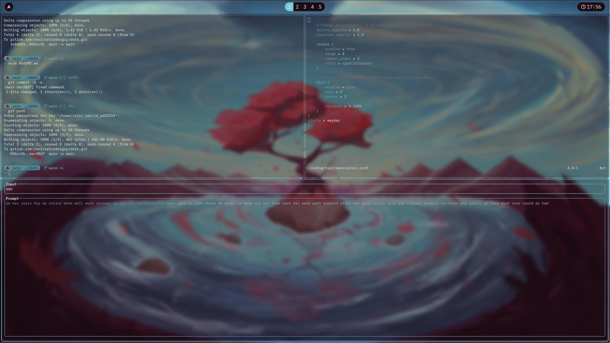
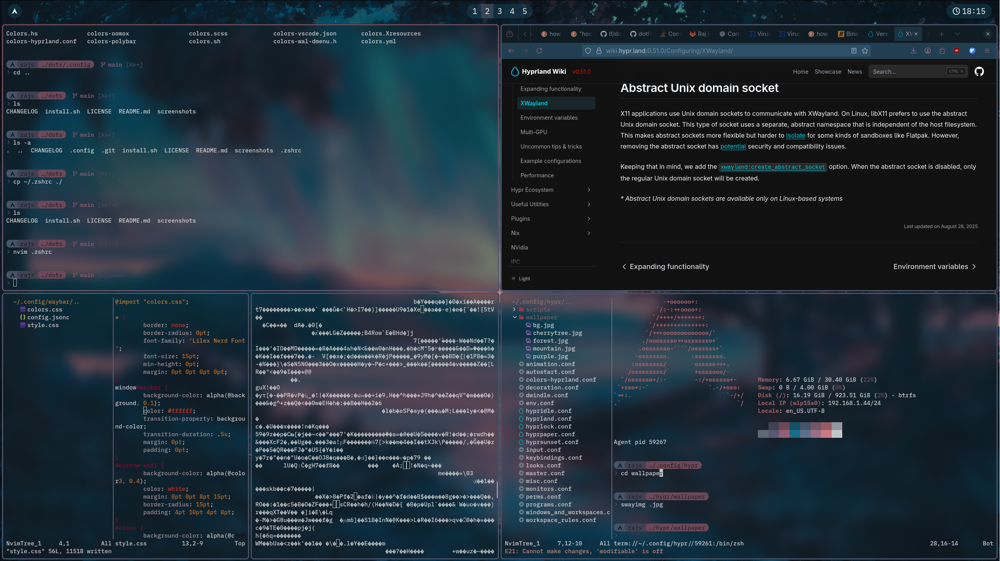
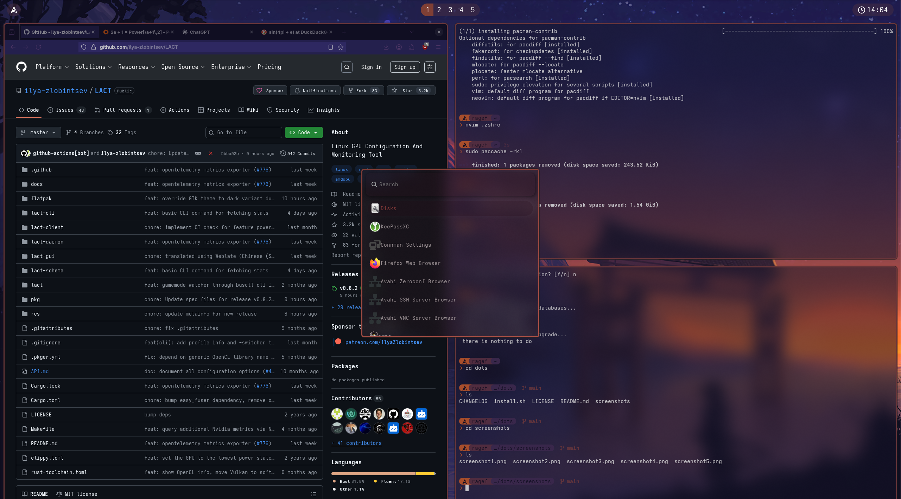
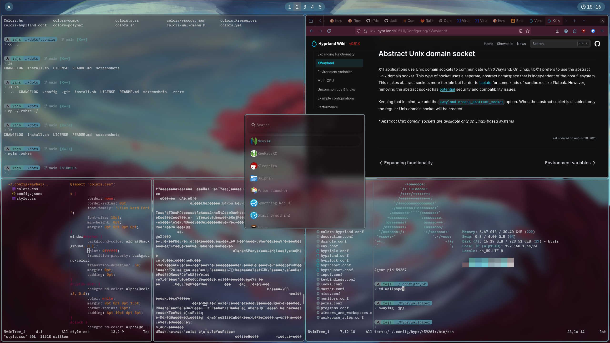
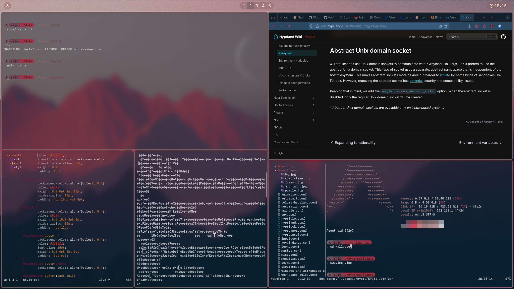
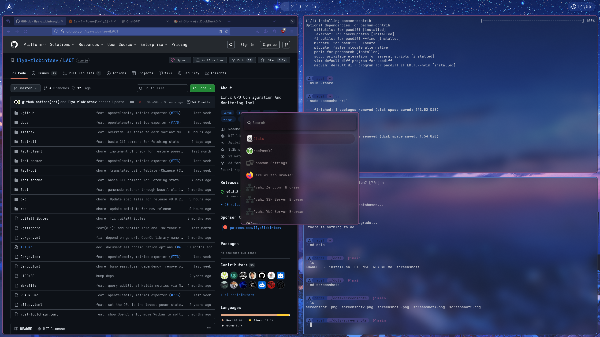

# Dots
## NOTICE:
## These dotfiles rely on Pywal16 heavily. Not pywal, pywal16. PLEASE Do Not attempt to use anything from here before:
* Installing pywal16
* running fullwal.sh(.config/hypr/scripts/fullwal.sh)
## These are also hardcoded for my monitors, please change the following: 
* `~/.config/hypr/scripts/fullwal.sh`
* `~/.config/hypr/hyprpaper.conf`
## If you are using any init system aside from runit, please change ~/.config/hypr/autostart.conf to use systemctl
## If your distro does not show up automatically in the prompt, add it to ~/.config/starship.toml

Welcome to my dotfiles! Take whatever you like, but here are a few suggestions:
Use your own wallpaper. I have a script for this that can import wallpapers into the folder for future use.
Modify monitors.conf to suit your own monitor. I have a 165hz 1440p, but that's kinda niche.

## aurh
Is deprecated. just use paru like a sane one.

# Install
You can use `curl -sS https://gitlab.com/coolrustcoderguy/dots/-/raw/main/install.sh | bash` for Artix, Arch, etc.
Or manually install all dependencies and use dotter deploy
# Dependencies:
## Shells/Terminal: 
`bash` 
`kitty`
`starship`
`zsh`

## Hypr Ecosystem:
`hypridle`
`hyprland`
`hyprlock`
`hyprpaper`
`hyprpolkitagent`
`hyprsunset`

## Pywal/Wallpaper/Fullwal.sh:
`imagemagick`(Substitutable with `graphicsmagick`)
`pywal16`
`swayimg`

## Utilities:
`nvim`
`paru`(needed for install)(also just use an AUR Helper bro you're not cool)
`dotter`(Needed for install, you can copy dotfiles but I highly recommend dotter, it's pretty cool!)
`swaync`
`waybar`
`wofi`
`wlogout`

Screenshots:

